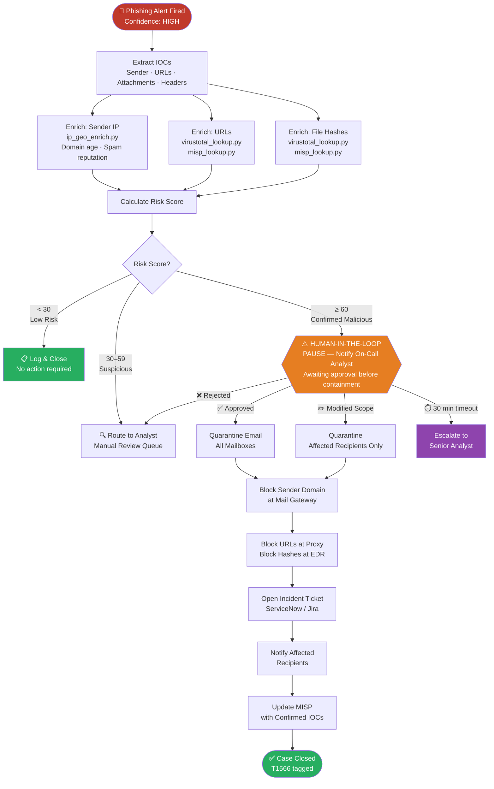

# Diagram — Phishing Email Response (Playbook 01)

```mermaid
flowchart TD
    A([🚨 Phishing Alert Fired\nConfidence: HIGH]) --> B[Extract IOCs\nSender · URLs · Attachments · Headers]

    B --> C1[Enrich: Sender IP\nip_geo_enrich.py\nDomain age · Spam reputation]
    B --> C2[Enrich: URLs\nvirustotal_lookup.py\nmisp_lookup.py]
    B --> C3[Enrich: File Hashes\nvirustotal_lookup.py\nmisp_lookup.py]

    C1 --> D[Calculate Risk Score]
    C2 --> D
    C3 --> D

    D --> E{Risk Score?}

    E -->|< 30\nLow Risk| F[📋 Log & Close\nNo action required]

    E -->|30–59\nSuspicious| G[🔍 Route to Analyst\nManual Review Queue]

    E -->|≥ 60\nConfirmed Malicious| H

    H{{"⚠️ HUMAN-IN-THE-LOOP\nPAUSE — Notify On-Call Analyst\nAwaiting approval before containment"}}

    H -->|✅ Approved| I[Quarantine Email\nAll Mailboxes]
    H -->|✏️ Modified Scope| J[Quarantine\nAffected Recipients Only]
    H -->|❌ Rejected| G
    H -->|⏱️ 30 min timeout| K[Escalate to\nSenior Analyst]

    I --> L[Block Sender Domain\nat Mail Gateway]
    J --> L
    L --> M[Block URLs at Proxy\nBlock Hashes at EDR]
    M --> N[Open Incident Ticket\nServiceNow / Jira]
    N --> O[Notify Affected\nRecipients]
    O --> P[Update MISP\nwith Confirmed IOCs]
    P --> Q([✅ Case Closed\nT1566 tagged])

    style A fill:#c0392b,color:#fff
    style H fill:#e67e22,color:#fff
    style F fill:#27ae60,color:#fff
    style Q fill:#27ae60,color:#fff
    style K fill:#8e44ad,color:#fff
```
