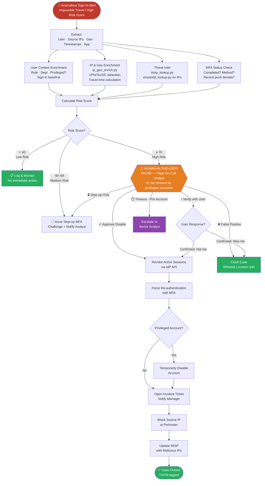

# Diagram — Suspicious Login Response (Playbook 02)

```mermaid
flowchart TD
    A([🚨 Anomalous Sign-In Alert\nImpossible Travel / High Risk Score]) --> B[Extract:\nUser · Source IPs · Geo · Timestamps · App]

    B --> C1[User Context Enrichment\nRole · Dept · Privileged?\nSign-in baseline]
    B --> C2[IP & Geo Enrichment\nip_geo_enrich.py\nVPN/Tor/DC detection\nTravel time calculation]
    B --> C3[Threat Intel\nmisp_lookup.py\nvirustotal_lookup.py on IPs]
    B --> C4[MFA Status Check\nCompleted? Method?\nRecent push denials?]

    C1 --> D[Calculate Risk Score]
    C2 --> D
    C3 --> D
    C4 --> D

    D --> E{Risk Score?}

    E -->|< 40\nLow Risk| F[📋 Log & Monitor\nNo immediate action]

    E -->|40–69\nMedium Risk| G[🔐 Issue Step-up MFA\nChallenge + Notify Analyst]

    E -->|≥ 70\nHigh Risk| H

    H{{"⚠️ HUMAN-IN-THE-LOOP\nPAUSE — Page On-Call Analyst\n15 min timeout for privileged accounts"}}

    H -->|✅ Approve Disable| I[Revoke Active Sessions\nvia IdP API]
    H -->|🔒 Step-up Only| G
    H -->|📞 Verify with User| J{User Response?}
    H -->|❌ False Positive| K[Close Case\nWhitelist Location 24h]
    H -->|⏱️ Timeout - Priv Account| L[Escalate to\nSenior Analyst]

    J -->|Confirmed: Not me| I
    J -->|Confirmed: Was me| K

    I --> M[Force Re-authentication\nwith MFA]
    M --> N{Privileged Account?}
    N -->|Yes| O[Temporarily Disable\nAccount]
    N -->|No| P[Open Incident Ticket\nNotify Manager]
    O --> P
    P --> Q[Block Source IP\nat Perimeter]
    Q --> R[Update MISP\nwith Malicious IPs]
    R --> S([✅ Case Closed\nT1078 tagged])

    style A fill:#c0392b,color:#fff
    style H fill:#e67e22,color:#fff
    style F fill:#27ae60,color:#fff
    style K fill:#27ae60,color:#fff
    style S fill:#27ae60,color:#fff
    style L fill:#8e44ad,color:#fff
```
