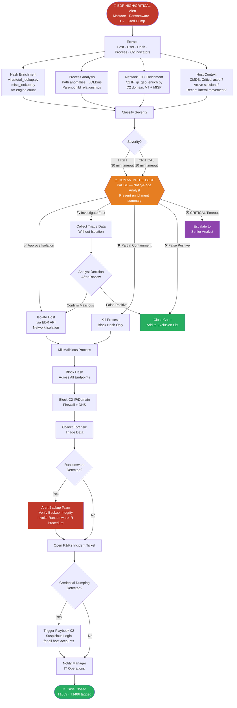

# Diagram — Malware / Endpoint Alert Response (Playbook 03)

```mermaid
flowchart TD
    A([🚨 EDR HIGH/CRITICAL Alert\nMalware · Ransomware · C2 · Cred Dump]) --> B[Extract:\nHost · User · Hash · Process · C2 indicators]

    B --> C1[Hash Enrichment\nvirustotal_lookup.py\nmisp_lookup.py\nAV engine count]
    B --> C2[Process Analysis\nPath anomalies · LOLBins\nParent-child relationships]
    B --> C3[Network IOC Enrichment\nC2 IP: ip_geo_enrich.py\nC2 domain: VT + MISP]
    B --> C4[Host Context\nCMDB: Critical asset?\nActive sessions?\nRecent lateral movement?]

    C1 --> D[Classify Severity]
    C2 --> D
    C3 --> D
    C4 --> D

    D --> E{Severity?}

    E -->|HIGH\n30 min timeout| F
    E -->|CRITICAL\n10 min timeout| F

    F{{"⚠️ HUMAN-IN-THE-LOOP\nPAUSE — Notify/Page Analyst\nPresent enrichment summary"}}

    F -->|✅ Approve Isolation| G[Isolate Host\nvia EDR API\nNetwork isolation]
    F -->|🔍 Investigate First| H[Collect Triage Data\nWithout Isolation]
    F -->|🛡️ Partial Containment| I[Kill Process\nBlock Hash Only]
    F -->|❌ False Positive| J[Close Case\nAdd to Exclusion List]
    F -->|⏱️ CRITICAL Timeout| K[Escalate to\nSenior Analyst]

    H --> L{Analyst Decision\nAfter Review}
    L -->|Confirm Malicious| G
    L -->|False Positive| J

    G --> M[Kill Malicious Process]
    I --> M
    M --> N[Block Hash\nAcross All Endpoints]
    N --> O[Block C2 IP/Domain\nFirewall + DNS]
    O --> P[Collect Forensic\nTriage Data]
    P --> Q{Ransomware\nDetected?}
    Q -->|Yes| R[Alert Backup Team\nVerify Backup Integrity\nInvoke Ransomware IR Procedure]
    Q -->|No| S[Open P1/P2 Incident Ticket]
    R --> S
    S --> T{Credential Dumping\nDetected?}
    T -->|Yes| U[Trigger Playbook 02\nSuspicious Login\nfor all host accounts]
    T -->|No| V[Notify Manager\nIT Operations]
    U --> V
    V --> W([✅ Case Closed\nT1059 · T1486 tagged])

    style A fill:#c0392b,color:#fff
    style F fill:#e67e22,color:#fff
    style J fill:#27ae60,color:#fff
    style W fill:#27ae60,color:#fff
    style K fill:#8e44ad,color:#fff
    style R fill:#c0392b,color:#fff
```
