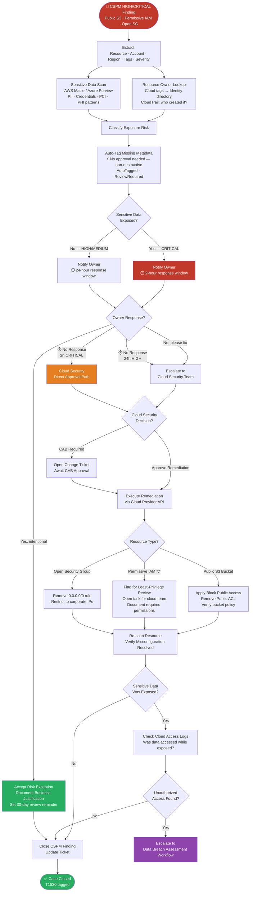

# Diagram — Cloud Misconfiguration Response (Playbook 04)

```mermaid
flowchart TD
    A([🚨 CSPM HIGH/CRITICAL Finding\nPublic S3 · Permissive IAM · Open SG]) --> B[Extract:\nResource · Account · Region · Tags · Severity]

    B --> C1[Resource Owner Lookup\nCloud tags → Identity directory\nCloudTrail: who created it?]
    B --> C2[Sensitive Data Scan\nAWS Macie / Azure Purview\nPII · Credentials · PCI · PHI patterns]

    C1 --> D[Classify Exposure Risk]
    C2 --> D

    D --> E[Auto-Tag Missing Metadata\n⚡ No approval needed — non-destructive\nAutoTagged · ReviewRequired]

    E --> F{Sensitive Data\nExposed?}

    F -->|Yes — CRITICAL| G[Notify Owner\n⏱️ 2-hour response window]
    F -->|No — HIGH/MEDIUM| H[Notify Owner\n⏱️ 24-hour response window]

    G --> I{Owner Response?}
    H --> I

    I -->|"Yes, intentional"| J[Accept Risk Exception\nDocument Business Justification\nSet 30-day review reminder]
    I -->|"No, please fix"| K[Escalate to\nCloud Security Team]
    I -->|⏱️ No Response\n2h CRITICAL| L[Cloud Security\nDirect Approval Path]
    I -->|⏱️ No Response\n24h HIGH| K

    K --> M{Cloud Security\nDecision?}
    L --> M

    M -->|Approve Remediation| N[Execute Remediation\nvia Cloud Provider API]
    M -->|CAB Required| O[Open Change Ticket\nAwait CAB Approval]

    O --> N

    N --> P{Resource Type?}
    P -->|Public S3 Bucket| Q[Apply Block Public Access\nRemove Public ACL\nVerify bucket policy]
    P -->|Permissive IAM *:*| R[Flag for Least-Privilege Review\nOpen task for cloud team\nDocument required permissions]
    P -->|Open Security Group| S[Remove 0.0.0.0/0 rule\nRestrict to corporate IPs]

    Q --> T[Re-scan Resource\nVerify Misconfiguration Resolved]
    R --> T
    S --> T

    T --> U{Sensitive Data\nWas Exposed?}
    U -->|Yes| V[Check Cloud Access Logs\nWas data accessed while exposed?]
    U -->|No| W[Close CSPM Finding\nUpdate Ticket]

    V --> X{Unauthorized\nAccess Found?}
    X -->|Yes| Y[Escalate to\nData Breach Assessment Workflow]
    X -->|No| W

    J --> W
    W --> Z([✅ Case Closed\nT1530 tagged])

    style A fill:#c0392b,color:#fff
    style G fill:#c0392b,color:#fff
    style J fill:#27ae60,color:#fff
    style Z fill:#27ae60,color:#fff
    style L fill:#e67e22,color:#fff
    style Y fill:#8e44ad,color:#fff
```
